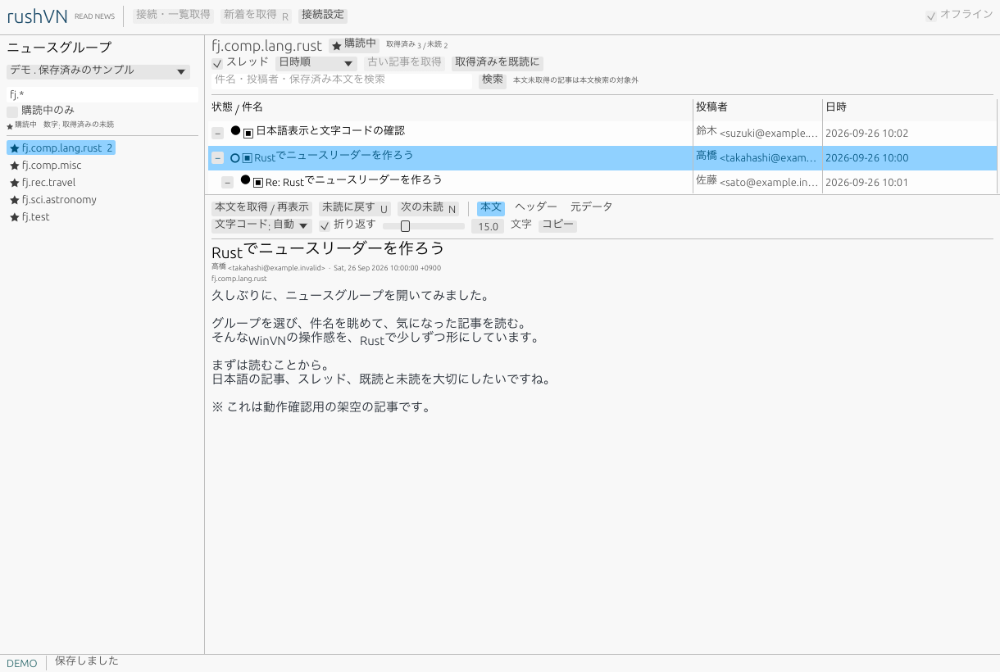

# rushVN

WinVNのような操作感でfjを読む、Rust製のデスクトップNNTPニュースリーダーです。初版は閲覧専用で、投稿・返信・下書きは後続版で対応します。

現在は最初の動作版です。macOSでビルドと実画面を確認しました。実サーバーのアカウントを使ったfjの記事取得は未検証です。



## 起動

Rustの開発環境を用意して、このディレクトリで実行します。

```sh
cargo run --locked
```

アカウントやネット接続なしで画面を試す場合:

```sh
cargo run --locked -- --demo
```

デモは架空の日本語記事を使い、通常の保存データとは別の一時ディレクトリに保存します。外部サーバーへの取得操作は無効です。

## fjを読む

1. 「接続設定」で表示名・ホスト・ポート・接続方式・アカウントを入力し、保存します。
2. 「接続・一覧取得」を押します。
3. 左の検索欄の `fj.*` でグループを絞り、読みたいグループを選んで「購読する」を押します。
4. 「新着を取得」で記事概要を取得し、件名を選ぶと本文を取得します。
5. 「オフライン」にすると取得済みの本文を通信なしで読めます。

接続先の初期値は空欄です。利用するNNTPサービスの案内に従ってホスト・ポート・接続方式を設定してください。アカウント登録の要否はサービスによって異なります。認証情報はアプリの設定画面に入力してください。TLS方式の初期値563は標準ポートであり、接続先の指定ではありません。

初回は最新1,000記事番号分を取得します。取得件数は設定で変更できます。「古い記事を取得」で過去へ、「新着を取得」で前回確認した番号の続きへ進みます。未読件数は**取得済みの記事概要の範囲**です。過去のfj全履歴を取得できるという意味ではありません。

## 実装した機能

- 3ペイン表示、ペイン・一覧列のサイズ変更、スレッドの展開／折りたたみ、件名・投稿者・日時順の表示。
- 複数サーバーの設定、暗黙TLS／STARTTLS、TLS上のユーザー認証。
- グループ一覧・階層絞り込み・購読、OVER／XOVERによる分割取得。
- 日本語テキストとMIMEヘッダー、UTF-8／ISO-2022-JP／Shift_JIS／EUC-JP、文字コードの手動変更。
- 未読・既読、同一サーバー内の取得済みクロスポストへの既読反映。
- SQLiteによる購読・既読・記事の保存、オフライン閲覧、保存済み件名・投稿者・本文の検索。
- 本文・ヘッダー・元データの表示、文字サイズ・折り返し・コピー。
- 通信キャンセル、タイムアウト、認証・失効記事・不正応答のエラー表示。

| キー | 操作 |
| --- | --- |
| `J` / `K` | 次／前の記事 |
| `N` | 次の未読記事 |
| `U` | 選択記事を未読に戻す |
| `R` | 新着の記事概要を取得 |
| `←` / `→` | 選択スレッドの折りたたみ／展開 |
| `Alt + ↑` / `Alt + ↓` | 表示中のグループ一覧を移動 |

検索欄の入力中と接続設定画面では、これらのショートカットを実行しません。

## 保存と接続

通常はOSのアプリ用データディレクトリ（macOSでは `~/Library/Application Support/org.rushVN.rushVN/`）に保存します。場所を指定することもできます。

```sh
cargo run --locked -- --data-dir .local/news
```

- `news.sqlite3`: 接続設定、購読、既読、記事概要、本文キャッシュ。
- `window.ron`: ウィンドウ、表示設定、選択していたサーバーとグループ。
- パスワード: 初期設定ではセッション内のみ。明示的に選択した場合はOSの資格情報ストア。設定ファイルには保存しません。

本文キャッシュは元データと検索用本文の合計で1GiBを上限とし、古いものから整理します。SQLiteファイルには記事概要や空き領域もあるため、ファイル自体のサイズ上限ではありません。キャッシュを消しても購読・既読・概要は残ります。

証明書の検証を無効にする設定はありません。TLS失敗時に平文へ切り替えません。平文はlocalhostの試験用のみで、認証情報は送信しません。接続・読み書きにはタイムアウトがあり、ネットワーク操作はバックグラウンドで行います。

## ローカル接続試験

外部サービスなしで購読から本文取得までを試せます。

```sh
python3 scripts/mock_nntp.py
cargo run --locked -- --data-dir .local/mock
```

上記は別々のターミナルで実行します。接続設定はホスト `127.0.0.1`、接続方式「ローカル試験用・平文」、ポート `8119`、ユーザー名とパスワードは空欄です。`fj.test` に架空の記事、`fj.empty` に空グループがあります。

## 開発・検証

```sh
cargo fmt -- --check
cargo clippy --locked --all-targets -- -D warnings
cargo test --locked
cargo run --locked --example measure_cache
```

通信テストはlocalhostに一時的なサーバーを立てます。TLSのテスト用証明書については [fixturesの説明](tests/fixtures/README.md)を参照してください。

```sh
cargo run --locked -- --demo --screenshot /tmp/rushvn-demo.png
```

実ウィンドウを描画してPNGを保存し、終了します。GUIセッションが必要です。

## 現在の制限

- 実サーバーでの認証・fj本文取得、OS資格情報ストアへの実保存、日本語IMEの実入力、支援技術の操作、Windows／Linuxのビルド・実機は未検証です。
- 本文の外部リンクを直接開く機能は未実装です。必要ならコピーしてください。
- HTML描画、添付ファイルの展開、バイナリ記事、SASL認証、.newsrc移行は未対応です。
- 文字コード未指定の記事はUTF-8またはISO-2022-JPを推定します。Shift_JIS／EUC-JPは必要に応じて手動指定してください。
- 本文表示は先頭20,000行までです。超過を画面に表示し、保存済み元データは切り捨てません。「元データ」の画面表示はUTF-8の損失許容変換です。
- 通信は操作ごとに接続します。接続の再利用、自動巡回、取得中の件数進捗は未実装です。
- 10万件の保存・読み込み・スレッド処理は測定済みですが、10万件でのGUI応答時間と強制終了時の復旧試験は未完了です。
- OSの日本語フォントを使用します。見つからない場合は `RUSHVN_FONT` に日本語フォントファイルのパスを指定してください。フォントファイルは同梱していません。

設計・検証範囲は [実装メモ](docs/implementation.md)、製品要件と未確定事項は [要件定義書](docs/requirements.md)を参照してください。

## 公開用リポジトリの管理

[個人情報の除外方針](docs/privacy.md)を参照してください。コミット前に `python3 scripts/check_privacy.py`、公開前に `python3 scripts/check_privacy.py --history` を実行します。
